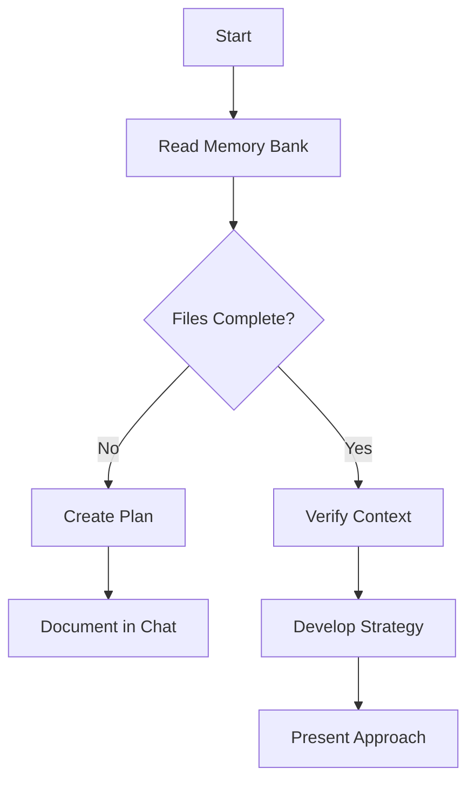
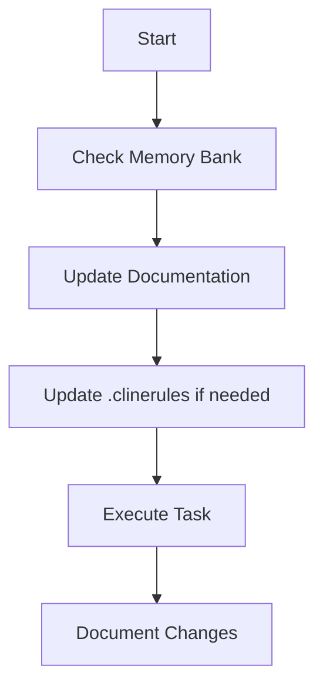

# ReadAI Copilot Instructions

ReadAI is an AI-powered document interaction platform combining PDF management, image text extraction, and text-to-speech functionality using Docker Compose architecture with Supabase backend.

## Quick Architecture Overview

**Stack**: Docker Compose with Express.js backend + React frontend + Supabase + Gemini AI  
**Core Features**: Image OCR, Text-to-Speech, PDF Library Management

### System Components
- **Backend** (`backend/`): Express.js API with Gemini AI integration and Supabase storage
- **Frontend** (`frontend/`): React + TypeScript + Vite with Shadcn/ui components  
- **Database/Storage**: Supabase (auth, PostgreSQL, file storage)
- **AI Services**: Google Gemini for vision OCR and audio generation

## Critical Development Patterns

### Backend Architecture (`backend/src/`)
**Single Service Integration Pattern:**
- `geminiService.js` - ALL AI operations (uses "Digital Muhaqqiq" prompt for OCR accuracy)
- `supabaseService.js` - ALL database/storage operations  
- `app.js` - Express setup with comprehensive middleware chain

**Request Flow:**
```
Routes → Controllers → Services → External APIs (Gemini/Supabase)
```

### Frontend Architecture (`frontend/src/`)
**Centralized API Pattern:**
- `services/apiService.ts` - ALL backend communication with auth headers
- Context API for global state (`BooksContext`, `AuthContext`, `UIContext`)
- React Query for server state caching
- PDF.js worker served from `/pdf.worker.min.js` (configured in `main.tsx`)

### Key Integration Points
**PDF Processing:** Server-side thumbnails using Poppler (pdftoppm) → Supabase storage  
**Authentication:** JWT tokens with middleware protection  
**CORS:** Dynamic origin handling in `corsMiddleware.js`  
**File Storage:** Structured user-specific paths in `readai-media` bucket

## Essential Development Commands

**Development Stack (Docker):**
```bash
# Full stack startup
docker-compose -f docker-compose.dev.yml up -d --build

# Backend only restart (common during API changes)  
docker-compose -f docker-compose.dev.yml up -d --build backend

# Monitor backend logs
docker-compose -f docker-compose.dev.yml logs -f backend
```

**Alternative Local Development:**
```bash
cd backend && npm run dev    # Requires .env with API keys
cd frontend && npm run dev   # Runs on port 8080
```

## Memory Bank System (CRITICAL)

ReadAI uses a comprehensive memory bank system in `memory-bank/` that **MUST** be read before any task:

**Core Files (Read ALL before starting):**
- `projectbrief.md` - Foundation requirements and scope
- `systemPatterns.md` - Architecture decisions and design patterns  
- `activeContext.md` - Current work focus and recent changes
- `progress.md` - Implementation status and known issues
- `techContext.md` - Technology stack and constraints

**Workflow Pattern:**
1. Read ALL memory bank files first
2. Verify understanding against actual codebase
3. Execute task maintaining established patterns
4. Update memory bank files if patterns change

## Project-Specific Conventions

**Code Architecture (SOLID & OOP):**
- Follow SOLID principles for maintainable, extensible code
- Use class-based services (`GeminiService`, `SupabaseService`) with clear responsibilities
- Dependency injection for testability and loose coupling
- Interface segregation - small, focused service methods
- Open/Closed principle - extend functionality without modifying existing code

**AI Integration:**  
- "Digital Muhaqqiq" prompt significantly improves OCR accuracy
- Text length limits (1000 chars) for cost control
- Centralized error handling for API rate limits

**PDF Handling:**  
- Server-side thumbnail generation (not client-side to avoid CORS issues)
- External URL proxy through backend for security
- React-PDF with local worker file configuration

**Security Patterns:**
- Comprehensive CORS with environment-specific origins
- JWT middleware protection for authenticated routes
- Rate limiting with express-rate-limit
- Helmet security headers

## Key Files for Context

**Backend Core:**
- `backend/src/services/geminiService.js` - AI integration hub
- `backend/src/middleware/corsMiddleware.js` - CORS configuration
- `backend/src/controllers/booksController.js` - PDF library operations

**Frontend Core:**  
- `frontend/src/services/apiService.ts` - API communication layer
- `frontend/src/contexts/BooksContext.tsx` - Library state management
- `frontend/src/main.tsx` - PDF.js worker configuration

**Configuration:**
- `docker-compose.dev.yml` - Development environment setup
- `backend/.env` - API keys and database configuration
- `frontend/vite.config.ts` - Build and development server config

## Legacy Memory Bank System (Preserved for Cline compatibility)

The original memory bank workflow system is preserved below for Cline AI agent compatibility:

### Core Workflows

#### Plan Mode


#### Act Mode  


### Documentation Updates

Memory Bank updates occur when:
1. Discovering new project patterns
2. After implementing significant changes  
3. When user requests with **update memory bank** (MUST review ALL files)
4. When context needs clarification

The .clinerules file captures project-specific patterns, preferences, and coding standards discovered through development. It grows smarter as work progresses and should be consulted and updated as patterns emerge.